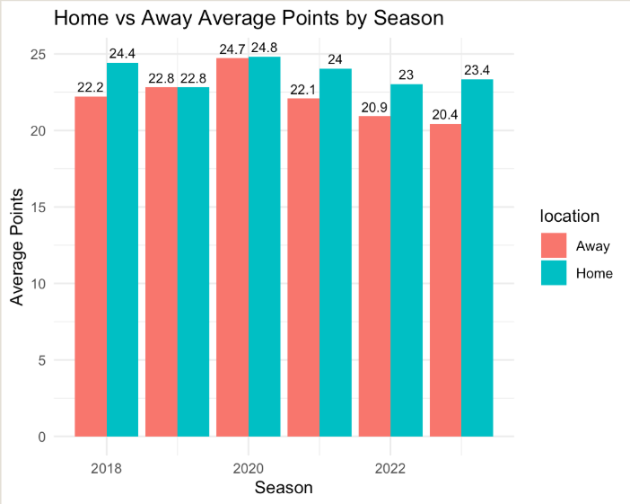
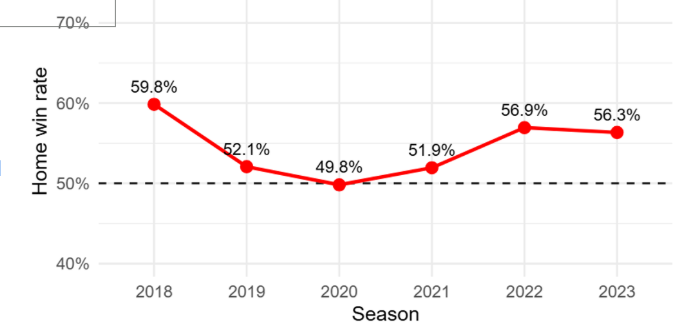

# NFL Home-Field Advantage Analysis

This repository is to store and share the work of Daniel, Mohammed, and Siddhant as we work on the NFL game outcomes data from 2018 to 2023 in an attempt to find a statistical relationship which proves whether or not there is a true home field advantage in the NFL. 

## Overview

Our purpose is to apply what we have learned about R and statistics in order to determine if there is enough statistical evidence to back up the claim that NFL teams have a home field advantage. We will need to clean the data by removing neutral site games and columns which are unnecessary for our analysis. Next we will derive new variables and create new tables. These tables will be used to create visualizations including: Pie chart comparing amount of home wins to total games, Line chart showing the win percentage of home teams for each year, and Side by Side Bar chart showing the average points of home teams and away teams each year. 

### Interesting Insight 

Because the home win rate was approximately 50% and the average points per game were nearly equal between home and away teams in 2020—when fans were not allowed—while the years before and after 2020 show a home win rate well above 50% and about a 2-point average scoring advantage, we can conclude that there is statistical evidence supporting the existence of a home-field advantage in the NFL when fans are present.

## Data Sources and Acknowledgements

We have found our data on the SCORE Sports Data Repository at the link below:
https://data.scorenetwork.org/football/nfl-game-outcomes.html

## Current Plan

We plan to analyze the performance in home games across the six years that we have complete data for and create useful visualizations which lead us to making insights about whether or not there is a home field advantage in the NFL, which statistics defend the conclusion, and any other interesting insights that we discover throughout our research. If any visitor would like to examine a more detailed plan including the goal, needs, and steps for our project there is a detailed plan file found in the repository.  

## Repo Structure

Our repository contains many different elements each playing a crucial role in the project. Firstly there is this readme which can be used to introduce others to our project and explain our goals. Next, the gitattributes file is a GitHub practice and can be ignored. The gitignore should also be ignored. The lintr and linting_script contain the process for linting or analyzing the R code for errors. The MLA9 and apa7 files are information regarding citing work. The Project_Guidelines file provides information for the requirements, key dates, data requirements, presentation, resources, and FAQ's. The nfl_mahomes_era_games.csv is the raw data which we found on the SCORE Sports Data Repository. The folder named NFL_home_field_advantage contains the files for our R scripts and PDF files of our visualizations. The plan file contains the detailed plan unique to our project for working with R, creating our analysis and completing the project. 

## Authors

Daniel Carney 	   	dsc5554@psu.edu
Mohammed Alghamdi  	mza6150@psu.edu
Siddhant Bhagat    	sqb6375@psu.edu
